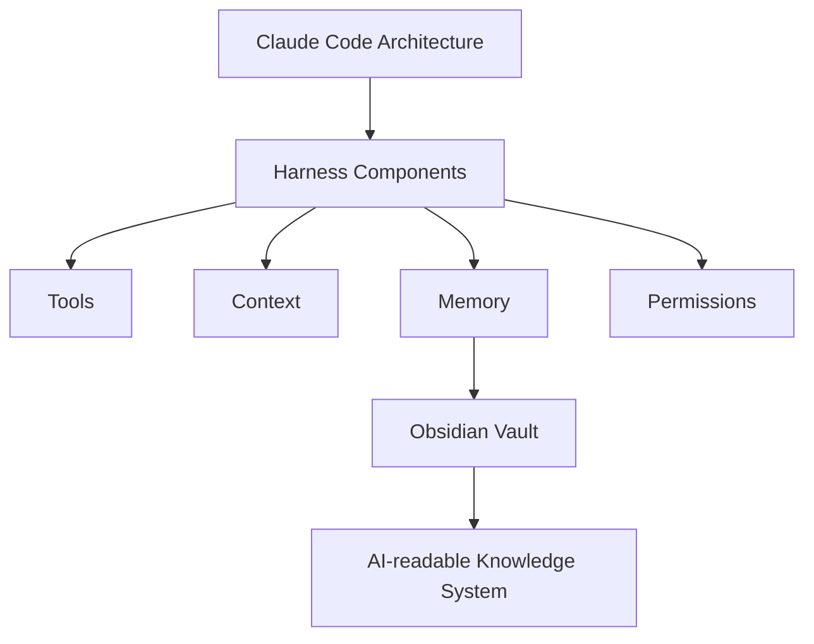

# Claude Code + Obsidian Learning

Claude Code architecture notes and Obsidian-based knowledge system experiments for studying AI agent harness engineering.

## Why

This repository is a learning workspace for turning Claude Code architecture study into a structured, AI-readable knowledge system.

The focus is not only "taking notes", but building a repeatable method for studying agent harness systems through Markdown, Obsidian, memory files, and project-level documentation.

## What is inside

| Path | Purpose |
|------|---------|
| [CLAUDE-CODE-OBSIDIAN-LEARNING.md](./CLAUDE-CODE-OBSIDIAN-LEARNING.md) | Main learning note and project narrative. |
| [docs/study-notes.md](./docs/study-notes.md) | Study notes for Claude Code architecture concepts. |
| [claude-memory-qmd-config/](./claude-memory-qmd-config/) | Embedded memory configuration example. |
| [README.md](./README.md) | Repository entrypoint. |

## Learning map



## Recommended workflow

1. Read [CLAUDE-CODE-OBSIDIAN-LEARNING.md](./CLAUDE-CODE-OBSIDIAN-LEARNING.md) as the main entry.
2. Use [docs/study-notes.md](./docs/study-notes.md) to review the core architecture model.
3. Compare the learning notes against your local Obsidian vault.
4. Extract stable patterns into skills, templates, or memory entries.

## Core concepts

### 洋葱模型

```
最内层：query.ts → 直接与 API 对话
中间层：Tool + compact → 手脚 + 防爆
外围层：QueryEngine + Hooks → 生命周期管理
最外层：CLI + context → 入口感知
```

### 三大设计哲学
1. **洋葱模型** - 层层包裹大模型
2. **防御性设计** - 贯穿始终的三重保护
3. **异步影子系统** - 后台并发不阻塞

## Roadmap

- [ ] Add a top-level Obsidian vault index.
- [ ] Add project study templates for Cline, Aider, OpenHands, Goose, and Browser Use.
- [ ] Add a glossary for harness engineering terms.
- [ ] Link each architecture note to a reusable Claude Code skill or workflow.
- [ ] Add diagrams for context, memory, permissions, and tool execution.

## License

CC BY 4.0
